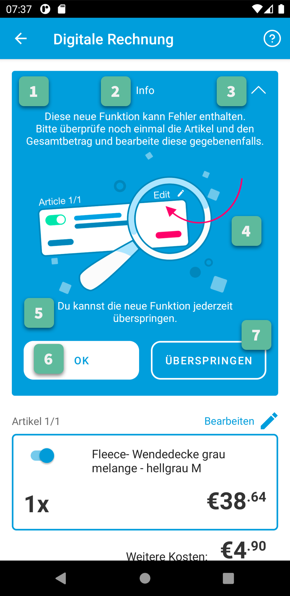
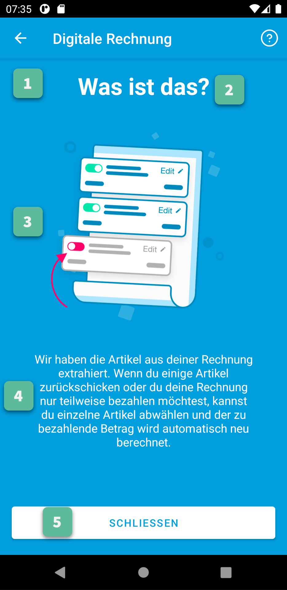
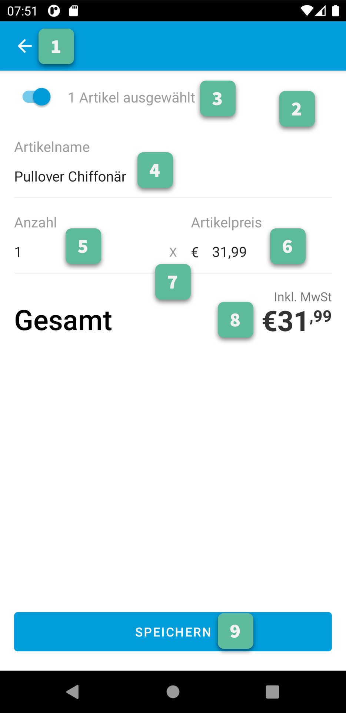

Customization Guide
===================

Customization of the Views is provided via overriding of app resources: dimensions, strings, colors, texts, etc.
Although all `resources of the Gini Bank SDK
<https://github.com/gini/gini-mobile-android/tree/main/bank-sdk/sdk/src/main/res>`_ can be overridden we recommend only
changing the resources listed in this customization guide.

The capture related screens are provided by the `Gini Capture SDK
<https://github.com/gini/gini-mobile-android/tree/main/capture-sdk>`_. Please consult the
:root_html_path_capture_sdk:`customization guide <customization-guide.html>` for the Gini Capture SDK to view a screen
based overview of the customizable resources.

.. note::
  
    When you override styles please make sure that you use the parent style with the ``Root.`` prefix. This ensures 
    that your custom style items are merged with the default ones.

.. contents::
   :depth: 2
   :local:

Return Assistant
----------------

.. _onboarding:

Onboarding Screen
~~~~~~~~~~~~~~~~~

.. figure:: _static/customization/Return-Assistant-Onboarding.png
   :figwidth: 324

1. Action Bar
^^^^^^^^^^^^^

All Action Bar customizations except the title are global to all Activities.

- **Title**

  Via the string resource named ``gbs_title_digital_invoice``.

- **Title Color**

  Via the color resource named ``gc_action_bar_title``.

- **Back Button Icon**

  Via images for mdpi, hdpi, xhdpi, xxhdpi, xxxhdpi named ``gc_action_bar_back``.
  Or via a vector drawable added to the ``drawable-anydpi`` resource folder.

- **Help Button**

  - **Icon**

    Via the vector drawable named ``gbs_menu_question_circle_info``.
    Or via a vector drawable added to the ``drawable-anydpi`` resource folder.

  - **Icon Tint Color**

    Via the color resource named ``gbs_digital_invoice_help_icon_tint``.

  - **Title**

    Via the string resource named ``gbs_digital_invoice_help_info``.

- **Background Color**

  Via the color resource named ``gc_action_bar``.

- **Status Bar Background Color**

  Via the color resource named ``gc_status_bar``.

  If you use a light background color, then you should set the ``gc_light_status_bar`` boolean
  resource to ``true``. This will cause the status bar contents to be drawn with a dark color.

:ref:`Back to screenshot. <onboarding>`

2. Background Color
^^^^^^^^^^^^^^^^^^^

- **Color**

  Via the color resource named ``gbs_digital_invoice_onboarding_fragment_background``.

:ref:`Back to screenshot. <onboarding>`

3. Title
^^^^^^^^

- **Text**

  Via the string resource named ``gbs_digital_invoice_onboarding_text_1``.

- **Text Style**

  Via overriding the style named ``GiniCaptureTheme.DigitalInvoice.Onboarding.Title.TextStyle`` (with
  parent style ``Root.GiniCaptureTheme.DigitalInvoice.Onboarding.Title.TextStyle``).

:ref:`Back to screenshot. <onboarding>`

4. Illustration
^^^^^^^^^^^^^^^

- **Image**

  Via images for mdpi, hdpi, xhdpi, xxhdpi, xxxhdpi named ``gbs_digital_invoice_list_image.png``.
  Or via a vector drawable added to the ``drawable-anydpi`` resource folder.

:ref:`Back to screenshot. <onboarding>`

5. Message
^^^^^^^^^^

- **Text**

  Via the string resource named ``gbs_digital_invoice_onboarding_text_2``.

- **Text Style**

  Via overriding the style named ``GiniCaptureTheme.DigitalInvoice.Onboarding.TextStyle`` (with
  parent style ``Root.GiniCaptureTheme.DigitalInvoice.Onboarding.TextStyle``).

:ref:`Back to screenshot. <onboarding>`

6. "Done" Button
^^^^^^^^^^^^^^^^^^^^

- **Title**

  Via the string resource named ``gbs_digital_invoice_onboarding_done_button_title``.

- **Button Style**

  Via overriding the style named ``GiniCaptureTheme.DigitalInvoice.Onboarding.Done.Button`` (with
  parent style ``Root.GiniCaptureTheme.DigitalInvoice.Onboarding.Done.Button``).

:ref:`Back to screenshot. <onboarding>`

7. "Don't Show Again" Button
^^^^^^^^^^^^^^^^^^^^^^^^^^^^

- **Title**

  Via the string resource named ``gbs_digital_invoice_onboarding_do_not_show_button_title``.

- **Button Style**

  Via overriding the style named ``GiniCaptureTheme.DigitalInvoice.Onboarding.Dismiss.Button`` (with
  parent style ``Root.GiniCaptureTheme.DigitalInvoice.Onboarding.Dismiss.Button``).

:ref:`Back to screenshot. <onboarding>`

.. _info-box:

Info Box
~~~~~~~~

1. Background
^^^^^^^^^^^^^

- **Color**

  Via the color resource named ``gbs_digital_invoice_header_background``.

:ref:`Back to screenshot. <info-box>`

2. Title and Message
^^^^^^^^^^^^^^^^^^^^

- **Title**

  Via the string resource named ``gbs_digital_header_title``.

- **Title Text Style**

  Via overriding the style named ``GiniCaptureTheme.DigitalInvoice.Header.TextStyle`` (with
  parent style ``Root.GiniCaptureTheme.DigitalInvoice.Header.TextStyle``).

- **Message**

  Via the string resource named ``gbs_digital_header_text_1``.

- **Message Text Style**

  Via overriding the style named ``GiniCaptureTheme.DigitalInvoice.Header.TextStyle`` (with
  parent style ``Root.GiniCaptureTheme.DigitalInvoice.Header.TextStyle``).

:ref:`Back to screenshot. <info-box>`

3. Expand/Collapse Button
^^^^^^^^^^^^^^^^^^^^^^^^^

- **Icon**

  Via a vector drawable named ``gbs_digital_header_arrow_up``.

- **Icon Tint Color**

  Via the color resource named ``gbs_digital_invoice_header_collapse_tint``.

:ref:`Back to screenshot. <info-box>`

4. Illustration
^^^^^^^^^^^^^^^

- **Image**

  Via images for mdpi, hdpi, xhdpi, xxhdpi, xxxhdpi named ``gbs_digital_header_image.png``.
  Or via a vector drawable added to the ``drawable-anydpi`` resource folder.

:ref:`Back to screenshot. <info-box>`

5. Bottom Message
^^^^^^^^^^^^^^^^^

- **Text**

  Via the string resource named ``gbs_digital_header_text_2``.

- **Text Style**

  Via overriding the style named ``GiniCaptureTheme.DigitalInvoice.Header.TextStyle`` (with
  parent style ``Root.GiniCaptureTheme.DigitalInvoice.Header.TextStyle``).

:ref:`Back to screenshot. <info-box>`

6. "OK" Button
^^^^^^^^^^^^^^

- **Title**

  Via the string resource named ``gbs_digital_invoice_header_button_1``.

- **Button Style**

  Via overriding the style named ``GiniCaptureTheme.DigitalInvoice.Header.Button1`` (with
  parent style ``Root.GiniCaptureTheme.DigitalInvoice.Header.Button1``).

:ref:`Back to screenshot. <info-box>`

7. "Skip" Button
^^^^^^^^^^^^^^^^

- **Title**

  Via the string resource named ``gbs_digital_invoice_header_button_2``.

- **Button Style**

  Via overriding the style named ``GiniCaptureTheme.DigitalInvoice.Header.Button2`` (with
  parent style ``Root.GiniCaptureTheme.DigitalInvoice.Header.Button2``).

:ref:`Back to screenshot. <info-box>`

.. _digital-invoice:

Digital Invoice Screen
~~~~~~~~~~~~~~~~~~~~~~

.. figure:: _static/customization/Digital-Invoice-Screen.png
   :figwidth: 324

1. Background
^^^^^^^^^^^^^

- **Color**

  Via the color resource named ``gbs_digital_invoice_fragment_background``.

:ref:`Back to screenshot. <digital-invoice>`

2. Line Item Index
^^^^^^^^^^^^^^^^^^

- **Text**

  Via the string resource named ``gbs_digital_invoice_line_item_index``.
  
  Please include two decimal format arguments:

  - Current Index: ``%1$d``
  - Total Count: ``%2$d``

- **Text Style**

  Via overriding the style named ``GiniCaptureTheme.DigitalInvoice.LineItem.Index.TextStyle`` (with
  parent style ``Root.GiniCaptureTheme.DigitalInvoice.LineItem.Index.TextStyle``).

:ref:`Back to screenshot. <digital-invoice>`

3. Line Item Edit Button
^^^^^^^^^^^^^^^^^^^^^^^^

- **Title**

  Via the string resource named ``gbs_digital_invoice_header_button_2``.

- **Icon**

  Via a vector drawable named ``gbs_edit_icon``.

- **Icon Tint Color**

  Via the color resource named ``gbs_digital_invoice_edit_button``.

- **Button Style**

  Via overriding the style named ``GiniCaptureTheme.DigitalInvoice.LineItem.Edit.TextStyle`` (with
  parent style ``Root.GiniCaptureTheme.DigitalInvoice.LineItem.Edit.TextStyle``).

:ref:`Back to screenshot. <digital-invoice>`

4. Line Item Card
^^^^^^^^^^^^^^^^^

- **Border Stroke Color**

  Via the color resource named ``gbs_digital_invoice_line_item_stroke``.

- **Toggle Switch Style**

  Via overriding the style named ``GiniCaptureTheme.DigitalInvoice.Switch`` (with
  parent style ``Root.GiniCaptureTheme.DigitalInvoice.Switch``).

- **Description Text Style**

  Via overriding the style named ``GiniCaptureTheme.DigitalInvoice.LineItem.Description.TextStyle`` (with
  parent style ``Root.GiniCaptureTheme.DigitalInvoice.LineItem.Description.TextStyle``).

- **Quantity Text Style**

  Via overriding the style named ``GiniCaptureTheme.DigitalInvoice.LineItem.Quantity.TextStyle`` (with
  parent style ``Root.GiniCaptureTheme.DigitalInvoice.LineItem.Quantity.TextStyle``).

- **Price Text Style - Integral Part**

  Via overriding the style named ``GiniCaptureTheme.DigitalInvoice.LineItem.GrossPrice.Integral.TextStyle`` (with
  parent style ``Root.GiniCaptureTheme.DigitalInvoice.LineItem.GrossPrice.Integral.TextStyle``).

- **Price Text Style - Fractional Part**

  Via overriding the style named ``GiniCaptureTheme.DigitalInvoice.LineItem.GrossPrice.Fractional.TextStyle`` (with
  parent style ``Root.GiniCaptureTheme.DigitalInvoice.LineItem.GrossPrice.Fractional.TextStyle``).

- **Delete Button (shown only for manually added line items)**

  - **Icon**

    Via a vector drawable named ``gbs_digital_invoice_remove``.

  - **Style** 

    Via overriding the style named ``GiniCaptureTheme.DigitalInvoice.Remove.Button`` (with
    parent style ``Root.GiniCaptureTheme.DigitalInvoice.Remove.Button``).

- **Disabled State Color**

  Via the color resource named ``gbs_digital_invoice_line_item_disabled``.

:ref:`Back to screenshot. <digital-invoice>`

5. Additional Costs
^^^^^^^^^^^^^^^^^^^

- **Name Text Style**

  Via overriding the style named ``GiniCaptureTheme.DigitalInvoice.Addon.Name.TextStyle`` (with
  parent style ``Root.GiniCaptureTheme.DigitalInvoice.Addon.Name.TextStyle``).

- **Price Text Style - Integral Part**

  Via overriding the style named ``GiniCaptureTheme.DigitalInvoice.Addon.Price.Integral.TextStyle`` (with
  parent style ``Root.GiniCaptureTheme.DigitalInvoice.Addon.Price.Integral.TextStyle``).

- **Price Text Style - Fractional Part**

  Via overriding the style named ``GiniCaptureTheme.DigitalInvoice.Addon.Price.Fractional.TextStyle`` (with
  parent style ``Root.GiniCaptureTheme.DigitalInvoice.Addon.Price.Fractional.TextStyle``).

:ref:`Back to screenshot. <digital-invoice>`

6. "Add Article" Button
^^^^^^^^^^^^^^^^^^^^^^^

- **Title**

  Via the string resource named ``gbs_digital_invoice_footer_add``.

- **Button Style**

  Via overriding the style named ``GiniCaptureTheme.DigitalInvoice.Add.Button`` (with
  parent style ``Root.GiniCaptureTheme.DigitalInvoice.Add.Button``).

:ref:`Back to screenshot. <digital-invoice>`

7. Total Price
^^^^^^^^^^^^^^

- **Total Price Label Text**

  Via the string resource named ``gbs_digital_invoice_footer_total_label``.

- **Total Price Label Text Style**

  Via overriding the style named ``GiniCaptureTheme.DigitalInvoice.TotalGrossPrice.Label.TextStyle`` (with
  parent style ``Root.GiniCaptureTheme.DigitalInvoice.TotalGrossPrice.Label.TextStyle``).

- **Explanation Text**

  Via the string resource named ``gbs_digital_invoice_footer_total_expl``.

- **Explanation Text Style**

  Via overriding the style named ``GiniCaptureTheme.DigitalInvoice.TotalGrossPrice.Expl.TextStyle`` (with
  parent style ``Root.GiniCaptureTheme.DigitalInvoice.TotalGrossPrice.Expl.TextStyle``).

- **Total Price Text Style - Integral Part**

  Via overriding the style named ``GiniCaptureTheme.DigitalInvoice.TotalGrossPrice.Integral.TextStyle`` (with
  parent style ``Root.GiniCaptureTheme.DigitalInvoice.TotalGrossPrice.Integral.TextStyle``).

- **Total Price Text Style - Fractional Part**

  Via overriding the style named ``GiniCaptureTheme.DigitalInvoice.TotalGrossPrice.Fractional.TextStyle`` (with
  parent style ``Root.GiniCaptureTheme.DigitalInvoice.TotalGrossPrice.Fractional.TextStyle``).

:ref:`Back to screenshot. <digital-invoice>`

8. Bottom Notice
^^^^^^^^^^^^^^^^

- **Text**

  Via the string resource named ``gbs_digital_invoice_footer_notice``.

- **Text Style**

  Via overriding the style named ``GiniCaptureTheme.DigitalInvoice.Footer.Notice.TextStyle`` (with
  parent style ``Root.GiniCaptureTheme.DigitalInvoice.Footer.Notice.TextStyle``).

:ref:`Back to screenshot. <digital-invoice>`

9. "Pay" Button
^^^^^^^^^^^^^^^^^^^^^^^

- **Title (pay at least one line item)**

  Via the string resource named ``gbs_digital_invoice_pay``.
  
  Please include two decimal format arguments:

  - Selected Items Count: ``%1$d``
  - Total Count: ``%2$d``

- **Title (pay only for other charges)**

  Via the string resource named ``gbs_digital_invoice_pay_other_charges``.

- **Title (disabled)**

  Via the string resource named ``gbs_digital_invoice_pay_disabled``.

- **Button Style**

  Via overriding the style named ``GiniCaptureTheme.DigitalInvoice.Pay.Button`` (with
  parent style ``Root.GiniCaptureTheme.DigitalInvoice.Pay.Button``).

:ref:`Back to screenshot. <digital-invoice>`

10. "Skip" Button
^^^^^^^^^^^^^^^^^^^^^^^

- **Title**

  Via the string resource named ``gbs_digital_invoice_footer_skip``.

- **Button Style**

  Via overriding the style named ``GiniCaptureTheme.DigitalInvoice.Skip.Button`` (with
  parent style ``Root.GiniCaptureTheme.DigitalInvoice.Skip.Button``).

:ref:`Back to screenshot. <digital-invoice>`

.. _return-reason-picker:

Return Reason Picker
~~~~~~~~~~~~~~~~~~~~

.. figure:: _static/customization/Digital-Invoice-Return-Reason-Picker.png
   :figwidth: 324

1. Title
^^^^^^^^

- **Text**

  Via the string resource named ``gbs_digital_invoice_return_reason_dialog_title``.

- **Text Style**

  Via overriding the style named ``GiniCaptureTheme.DigitalInvoice.ReturnReasonDialog.Title.TextStyle`` (with
  parent style ``Root.GiniCaptureTheme.DigitalInvoice.ReturnReasonDialog.Title.TextStyle``).

- **Divider Color**

  Via the color resource named ``gbs_digital_invoice_return_reason_dialog_divider``.

:ref:`Back to screenshot. <return-reason-picker>`

2. Return Reason Item
^^^^^^^^^^^^^^^^^^^^^

- **Text Style**

  Via overriding the style named ``GiniCaptureTheme.DigitalInvoice.ReturnReasonDialog.Item.TextStyle`` (with
  parent style ``Root.GiniCaptureTheme.DigitalInvoice.ReturnReasonDialog.Item.TextStyle``).

:ref:`Back to screenshot. <dreturn-reason-picker>`

.. _info-screen:

Info Screen
~~~~~~~~~~~

1. Background
^^^^^^^^^^^^^

- **Color**

  Via the color resource named ``gbs_digital_invoice_onboarding_fragment_background``.

:ref:`Back to screenshot. <info-screen>`

2. Title
^^^^^^^^

- **Text**

  Via the string resource named ``gbs_digital_invoice_info_text_1``.

- **Text Style**

  Via overriding the style named ``GiniCaptureTheme.DigitalInvoice.Info.Title.TextStyle`` (with
  parent style ``Root.GiniCaptureTheme.DigitalInvoice.Info.Title.TextStyle``).

:ref:`Back to screenshot. <info-screen>`

3. Illustration
^^^^^^^^^^^^^^^

- **Image**

  Via images for mdpi, hdpi, xhdpi, xxhdpi, xxxhdpi named ``gbs_digital_invoice_list_image.png``.
  Or via a vector drawable added to the ``drawable-anydpi`` resource folder.

:ref:`Back to screenshot. <info-screen>`

4. Message
^^^^^^^^^^

- **Text**

  Via the string resource named ``gbs_digital_invoice_info_text_2``.

- **Text Style**

  Via overriding the style named ``GiniCaptureTheme.DigitalInvoice.Info.TextStyle`` (with
  parent style ``Root.GiniCaptureTheme.DigitalInvoice.Info.TextStyle``).

:ref:`Back to screenshot. <info-screen>`

5. "Close" Button
^^^^^^^^^^^^^^^^^

- **Title**

  Via the string resource named ``gbs_digital_invoice_info_close_button_title``.

- **Button Style**

  Via overriding the style named ``GiniCaptureTheme.DigitalInvoice.Info.Button`` (with
  parent style ``Root.GiniCaptureTheme.DigitalInvoice.Info.Button``).

:ref:`Back to screenshot. <info-screen>`

.. _edit-line-item:

Edit Line Item Screen
~~~~~~~~~~~~~~~~~~~~~

1. Action Bar
^^^^^^^^^^^^^

All Action Bar customizations except the title are global to all Activities.

- **Title**

  Via the string resource named ``gbs_title_line_item_details``.

- **Title Color**

  Via the color resource named ``gc_action_bar_title``.

- **Back Button Icon**

  Via images for mdpi, hdpi, xhdpi, xxhdpi, xxxhdpi named ``gc_action_bar_back``.
  Or via a vector drawable added to the ``drawable-anydpi`` resource folder.

- **Background Color**

  Via the color resource named ``gc_action_bar``.

- **Status Bar Background Color**

  Via the color resource named ``gc_status_bar``.

  If you use a light background color, then you should set the ``gc_light_status_bar`` boolean
  resource to ``true``. This will cause the status bar contents to be drawn with a dark color.

:ref:`Back to screenshot. <edit-line-item>`

2. Background
^^^^^^^^^^^^^

- **Color**

  Via the color resource named ``gbs_digital_invoice_line_item_details_background``.

:ref:`Back to screenshot. <edit-line-item>`

3. Toggle Switch
^^^^^^^^^^^^^^^^

- **Label Text**

  Via the plural string resource named ``gbs_digital_invoice_line_item_details_selected_line_items`` and the additional string resource for selected
  state named ``gbs_digital_invoice_line_item_details_selected``.

  Please include two format arguments in the plural strings:

  - Quantity decimal: ``%1$d``
  - Suffix string: ``%2$s``

  Example:

  .. code-block:: xml

    <plurals name="gbs_digital_invoice_line_item_details_selected_line_items">
        <item quantity="other">%1$d Artikel %2$s</item>
    </plurals>
    <string name="gbs_digital_invoice_line_item_details_selected">ausgewählt</string>

- **Label Text Style**

  Via overriding the style named ``GiniCaptureTheme.DigitalInvoice.LineItemDetails.Checkbox.TextStyle`` (with
  parent style ``Root.GiniCaptureTheme.DigitalInvoice.LineItemDetails.Checkbox.TextStyle``).

- **Toggle Switch Style**

  Via overriding the style named ``GiniCaptureTheme.DigitalInvoice.Switch`` (with
  parent style ``Root.GiniCaptureTheme.DigitalInvoice.Switch``).

:ref:`Back to screenshot. <edit-line-item>`

4. 5. 6. Input Fields: Description, Quantity, Price
^^^^^^^^^^^^^^^^^^^^

- **Description Label Text**

  Via the string resource named ``gbs_digital_invoice_line_item_details_description_label``.

- **Quantity Label Text**

  Via the string resource named ``gbs_digital_invoice_line_item_details_quantity_label``.

- **Price Label Text**

  Via the string resource named ``gbs_digital_invoice_line_item_details_gross_price_label``.

- **Label Text Style**

  Via overriding the style named ``GiniCaptureTheme.DigitalInvoice.LineItemDetails.InputField.Hint.TextStyle`` (with
  parent style ``Root.GiniCaptureTheme.DigitalInvoice.LineItemDetails.InputField.Hint.TextStyle``).

- **Input Field Style**

  Via overriding the style named ``GiniCaptureTheme.DigitalInvoice.LineItemDetails.InputField.Style`` (with
  parent style ``Root.GiniCaptureTheme.DigitalInvoice.LineItemDetails.InputField.Style``).

- **Input Field Text Style**

  Via overriding the style named ``GiniCaptureTheme.DigitalInvoice.LineItemDetails.InputField.TextStyle`` (with
  parent style ``Root.GiniCaptureTheme.DigitalInvoice.LineItemDetails.InputField.TextStyle``).

- **Input Field Cursor Color**

  Via the color resource named ``gbs_digital_invoice_line_item_details_input_field_cursor``.

- **Input Field Text Selection Highlight Color**

  Via the color resource named ``gbs_digital_invoice_line_item_details_input_field_selection_highlight``.

:ref:`Back to screenshot. <edit-line-item>`

7. Multiplication Symbol
^^^^^^^^^^^^^^^^^^^^^^^^

- **Color**

  Via the color resource named ``gbs_digital_invoice_line_item_details_multiplication_symbol``.

:ref:`Back to screenshot. <edit-line-item>`

8. Total Price
^^^^^^^^^^^^^^

- **Total Price Label Text**

  Via the string resource named ``gbs_digital_invoice_line_item_details_total_label``.

- **Total Price Label Text Style**

  Via overriding the style named ``GiniCaptureTheme.DigitalInvoice.LineItemDetails.Total.TextStyle`` (with
  parent style ``Root.GiniCaptureTheme.DigitalInvoice.LineItemDetails.Total.TextStyle``).

- **Total Price Info Text**

  Via the string resource named ``gbs_digital_invoice_line_item_total_info_label``.

- **Total Price Info Text Style**

  Via overriding the style named ``GiniCaptureTheme.DigitalInvoice.LineItemDetails.Total.Info.TextStyle`` (with
  parent style ``Root.GiniCaptureTheme.DigitalInvoice.LineItemDetails.Total.Info.TextStyle``).

- **Total Price Text Style - Integral Part**

  Via overriding the style named ``GiniCaptureTheme.DigitalInvoice.TotalGrossPrice.Integral.TextStyle`` (with
  parent style ``Root.GiniCaptureTheme.DigitalInvoice.TotalGrossPrice.Integral.TextStyle``).

- **Total Price Text Style - Fractional Part**

  Via overriding the style named ``GiniCaptureTheme.DigitalInvoice.TotalGrossPrice.Fractional.TextStyle`` (with
  parent style ``Root.GiniCaptureTheme.DigitalInvoice.TotalGrossPrice.Fractional.TextStyle``).

:ref:`Back to screenshot. <edit-line-item>`

9. "Save" Button
^^^^^^^^^^^^^^^^^

- **Title**

  Via the string resource named ``gbs_digital_invoice_line_item_details_save``.

- **Button Style**

  Via overriding the style named ``GiniCaptureTheme.DigitalInvoice.LineItemDetails.Save.Button`` (with
  parent style ``Root.GiniCaptureTheme.DigitalInvoice.LineItemDetails.Save.Button``).

:ref:`Back to screenshot. <edit-line-item>`
