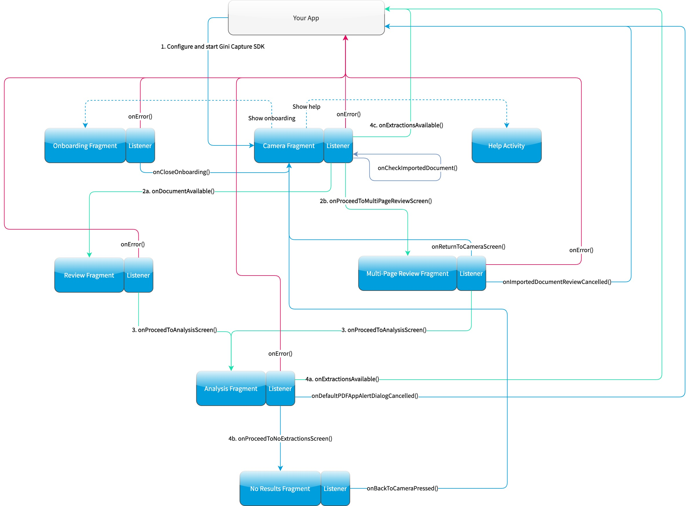

Integration
===========

Android Manifest
----------------

The Gini Capture SDK uses the camera therefore the camera permission is required:

.. code-block:: xml

    <manifest xmlns:android="http://schemas.android.com/apk/res/android"
        package="...">
        
        <uses-permission android:name="android.permission.CAMERA" />

    </manifest>

.. note::

    Make sure you request the camera permission before starting the SDK.

Requirements Check
------------------

We recommend running our runtime requirements check first before launching the Gini Capture SDK to ensure the device is
capable of taking pictures of adequate quality.

Simply run ``GiniCaptureRequirements.checkRequirements()`` and inspect the returned ``RequirementsReport`` for the result:

.. note::

    On Android 6.0 and later the camera permission is required before checking the requirements.

.. code-block:: java

    final RequirementsReport report = GiniCaptureRequirements.checkRequirements(this);
    if (!report.isFulfilled()) {
        final StringBuilder stringBuilder = new StringBuilder();
        report.getRequirementReports().forEach(requirementReport -> {
            if (!requirementReport.isFulfilled()) {
                stringBuilder.append(requirementReport.getRequirementId());
                stringBuilder.append(": ");
                stringBuilder.append(requirementReport.getDetails());
                stringBuilder.append("\n");
            }
        });
        Toast.makeText(this, "Requirements not fulfilled:\n" + stringBuilder,
                Toast.LENGTH_LONG).show();
    }

Configuration
-------------

Configuration and interaction is done using the ``GiniCapture`` singleton.

To configure and create a new instance use the ``GiniCapture.Builder`` returned by ``GiniCapture.newInstance()``. The
builder creates a new ``GiniCapture`` singleton which you will need to destroy later with ``GiniCapture.getInstance().cleanup()``.
This will also free up any used resources.

You should call ``cleanup()`` after the SDK returned control to your application and your app has sent feedback to the
Gini Bank API and is not using the SDK anymore.

To view all the configuration options see the documentation of `GiniCapture.Builder
<https://developer.gini.net/gini-mobile-android/capture-sdk/sdk/dokka/sdk/net.gini.android.capture/-gini-capture/-builder/index.html?query=public%20class%20Builder>`_.

Information about the configurable features are available on the `Features <features.html>`_ page.

Tablet Support
---------------

The Gini Capture SDK can be used on tablets, too. Some UI elements adapt to the larger screen to offer the best user
experience for tablet users.

Many tablets with at least 8MP cameras don't have an LED flash. Therefore we don't require flash for tablets. For this
reason the extraction quality on those tablets might be lower compared to smartphones.

On tablets landscape orientation is also supported (smartphones are portrait only). We advise you to test your
integration on tablets in both orientations.

In landscape the camera screen's UI displays the camera trigger button on the right side of the screen. Users
can reach the camera trigger more easily this way. The camera preview along with the document corner guides are shown in
landscape to match the device's orientation.

Other UI elements on all the screens maintain their relative position and the screen layouts are scaled automatically to
fit the current orientation.

Networking
----------

Communication with the Gini Bank API is not part of the Gini Capture SDK in order to allow you the freedom to use a
networking implementation of your own choosing.

.. note::

    You should have received Gini Bank API client credentials from us. Please get in touch with us in case you don’t have
    them. Without credentials you won't be able to use the Gini Bank API.

We provide two interfaces which need to be implemented to enable the SDK to analyze documents and retrieve extractions:

* ``GiniCaptureNetworkService``
   This interface is used to upload, analyze and delete documents. See the `reference documentation
   <https://developer.gini.net/gini-mobile-android/capture-sdk/sdk/dokka/sdk/net.gini.android.capture.network/-gini-capture-network-service/index.html>`_
   for details.

* ``GiniCaptureNetworkApi``
   This interface is used to declare network tasks which should be called by you outside of the Gini Capture SDK (e.g.,
   for sending feedback after the user saw and potentielly corrected the extractions).  See the `reference documentation
   <https://developer.gini.net/gini-mobile-android/capture-sdk/sdk/dokka/sdk/net.gini.android.capture.network/-gini-capture-network-api/index.html>`_
   for details.

Default Implementation
~~~~~~~~~~~~~~~~~~~~~~

The quickest way to add networking is to use the `Gini Capture Network
Library <https://github.com/gini/gini-capture-sdk-android/tree/master/ginicapture-network>`_.

To use it add the ``gini-capture-network-lib`` dependency to your app's ``build.gradle``:

.. code-block:: groovy

    dependencies {
        ...
        implementation 'net.gini.android:gini-capture-sdk-default-network:1.5.3'
    }

For the Gini Capture SDK to be aware of the default implementations create the instances and pass
them to the builder of ``GiniCapture``:

.. code-block:: java

    GiniCaptureDefaultNetworkService networkService = 
        GiniCaptureDefaultNetworkService.builder((Context) this)
            .setClientCredentials(myClientId, myClientSecret, myEmailDomain)
            .build();

    GiniCaptureDefaultNetworkApi networkApi = 
        GiniCaptureDefaultNetworkApi.builder()
            .withGiniCaptureDefaultNetworkService(networkService)
            .build();

    GiniCapture.newInstance()
        .setGiniCaptureNetworkService(networkService)
        .setGiniCaptureNetworkApi(networkApi)
        .build();

Both default implementations follow the builder pattern. See the documentation of
`GiniCaptureDefaultNetworkService.Builder
<https://developer.gini.net/gini-mobile-android/capture-sdk/default-network/dokka/default-network/net.gini.android.capture.network/-gini-capture-default-network-service/-builder/index.html>`_
and `GiniCaptureDefaultNetworkApi.Builder
<https://developer.gini.net/gini-mobile-android/capture-sdk/default-network/dokka/default-network/net.gini.android.capture.network/-gini-capture-default-network-api/-builder/index.html>`_
for configuration options.

Custom Implementation
~~~~~~~~~~~~~~~~~~~~~

You can also provide your own networking by implementing the ``GiniCaptureNetworkService`` and the
``GiniCaptureNetworkApi`` interfaces. Pass your instances to the builder of ``GiniCapture`` as shown
above.

You may also use the `Gini Bank API Library <https://github.com/gini/gini-mobile-android/bank-api-library>`_ for Android or implement
communication with the Gini Bank API yourself.

Sending Feedback
~~~~~~~~~~~~~~~~

Your app should send feedback for the extractions the Gini Bank API delivered. Feedback should be sent *only* for the
extractions the user has seen and accepted (or corrected).

// TODO: update links after Bank API is available

For additional information about feedback see the `Gini Bank API documentation
<https://pay-api.gini.net/documentation/#send-feedback-and-get-even-better-extractions-next-time>`_.

Default Implementation
^^^^^^^^^^^^^^^^^^^^^^

The example below shows how to correct extractions and send feedback using the default networking implementation:

.. note::

    We also provide a sample test case `here
    <https://github.com/gini/gini-mobile-android/blob/main/capture-sdk/default-network/src/androidTest/java/net/gini/android/capture/network/ExtractionFeedbackIntegrationTest.kt>`_
    to verify that extraction feedback sending works. You may use it along with the example pdf and json files as a
    starting point to write your own test case.

    The sample test case is based on the Bank API documentation's `recommended steps
    <https://pay-api.gini.net/documentation/#test-example>`_ for testing extraction feedback sending.

.. code-block:: java

   GiniCaptureDefaultNetworkApi networkApi; // Provided

   Map<String, GiniCaptureSpecificExtraction> extractions; // Provided

   // Modify the amount to pay extraction's value.
   GiniCaptureSpecificExtraction amountToPay = extractions.get("amountToPay");
   amountToPay.setValue("31:00");

   // You should send feedback only for extractions the user has seen and accepted.
   // In this example only the amountToPay was wrong and we can reuse the other extractions.
   Map<String, GiniCaptureSpecificExtraction> feedback = new HashMap<String, GiniCaptureSpecificExtraction>();
   feedback.put("iban", extractions.get("iban"));
   feedback.put("amountToPay", amountToPay);
   feedback.put("bic", extractions.get("bic"));
   feedback.put("senderName", extractions.get("senderName"));

   networkApi.sendFeedback(feedback, new GiniCaptureNetworkCallback<Void, Error>() {
            @Override
            public void failure(Error error) {
                // Handle the error.
            }

            @Override
            public void success(Void result) {
                // Feedback sent successfully.
            }

            @Override
            public void cancelled() {
                // Handle cancellation.
            }
        });

Custom Implementation
^^^^^^^^^^^^^^^^^^^^^

// TODO: update links after Bank API is available

If you use your own networking implementation and directly communicate with the Gini Bank API then see `this section
<https://pay-api.gini.net/documentation/#submitting-feedback-on-extractions>`_ in its documentation on how to send
feedback.

In case you use the Gini Bank API Library then see `this section
<https://developer.gini.net/gini-mobile-android/bank-api-library/library/html/guides/common-tasks.html#sending-feedback>`_ in its documentation
for details.

.. note::

    The Bank API documentation provides `recommended steps <https://pay-api.gini.net/documentation/#test-example>`_ for
    testing extraction feedback sending. You may use it along with the example pdf and json files as a starting point to
    write a test case for verifying that feedback sending works. 

Capturing documents
-------------------

The Gini Capture SDK can be used in two ways, either by using the *Screen API* or the *Component API*:

* The *Screen API* provides activities for easy integration that can be customized in a
  limited way. The screen and configuration design is based on our long-lasting experience with
  integration in customer apps.

* In the *Component API* we provide fragments for advanced integration
  with more freedom for customization.

Screen API
~~~~~~~~~~

This is the easiest way to use the SDK. You only need to:

#. Request camera access,
#. Configure a new instance of ``GiniCapture``,
#. Launch the ``CameraActivity``,
#. Handle the result.

.. note::

   Check out the `Screen API example app
   <https://github.com/gini/gini-capture-sdk-android/tree/main/screenapiexample>`_ to see how an integration could look
   like.

The ``CameraActivity`` can return with the following result codes:

* Activity.RESULT_OK

   Document was analyzed and the extractions are available in the ``EXTRA_OUT_EXTRACTIONS`` result extra. It contains a
   ``Bundle`` with the extraction labels as keys and ``GiniCaptureSpecificExtraction`` parcelables as values.

* Activity.RESULT_CANCELED
   
   User has canceled the Gini Capture SDK.

* CameraActivity.RESULT_ERROR

   An error occured and the details are available in the ``EXTRA_OUT_ERROR`` result extra. It contains a parcelable extra
   of type ``GiniCaptureError`` detailing what went wrong.

The following example shows how to launch the Gini Capture SDK using the *Screen API* and how to handle the results:

.. code-block:: java

    void launchGiniCapture() {
        // Make sure camera permission has been already granted at this point.
        
        // Check that the device fulfills the requirements.
        RequirementsReport report = GiniCaptureRequirements.checkRequirements((Context) this);
        if (!report.isFulfilled()) {
            handleUnfulfilledRequirements(report);
            return;
        }
        
        // Instantiate the networking implementations.
        GiniCaptureNetworkService networkService = ...
        GiniCaptureNetworkApi networkApi = ...

        // Cleanup GiniCapture to make sure everything is reset.
        GiniCapture.cleanup((Context) this);
        
        // Configure GiniCapture and create a new singleton instance.
        GiniCapture.newInstance()
                .setGiniCaptureNetworkService(networkService)
                .setGiniCaptureNetworkApi(networkApi)
                ...
                .build();
                
        // Launch the CameraActivity and wait for the result.
        Intent intent = new Intent(this, CameraScreenApiActivity.class);
        startActivityForResult(intent, GINI_CAPTURE_REQUEST);
    }

    @Override
    protected void onActivityResult(final int requestCode, final int resultCode,
            final Intent data) {
        super.onActivityResult(requestCode, resultCode, data);

        if (requestCode == GINI_CAPTURE_REQUEST) {
            switch (resultCode) {
                case Activity.RESULT_CANCELED:
                    break;

                case Activity.RESULT_OK:
                    // Retrieve the extractions
                    Bundle extractionsBundle = data.getBundleExtra(
                            CameraActivity.EXTRA_OUT_EXTRACTIONS);
                    
                    // Retrieve the extractions from the extractionsBundle
                    Map<String, GiniCaptureSpecificExtraction> extractions = new HashMap<>();
                    for (String extractionLabel : extractionsBundle.keySet()) {
                        GiniCaptureSpecificExtraction extraction = extractionsBundle.getParcelable(extractionLabel);
                        extractions.put(extractionLabel, extraction);
                    }
                    handleExtractions(extractions);

                    break;

                case CameraActivity.RESULT_ERROR:
                    // Something went wrong, retrieve and handle the error
                    final GiniCaptureError error = data.getParcelableExtra(
                            CameraActivity.EXTRA_OUT_ERROR);
                    if (error != null) {
                        handleError(error);
                    }

                    break;
            }
        }
    }

Component API
~~~~~~~~~~~~~

This is the more complicated way of using the SDK. The advantage is that it is based on fragments and you have full
control over how these are shown in your UI.

.. note::

   Check out the `Component API example app
   <https://github.com/gini/gini-capture-sdk-android/tree/main/componentapiexample>`_ to see how an integration could
   look like.

There is also one activity for showing the help screen. This is not a fragment in order to avoid overcomplicating
the Component API integration.

The fragments extend ``androidx.fragment.app.Fragment`` and to make it clear, that they are not native fragments we
suffix them with ``Compat``.

Each fragment has a ``createInstance()`` factory method. Some require arguments and those will have to be passed to this
factory method. 

Fragments also have a listener through which they inform you about events and which next fragment should
be shown. The result will be also returned through a listener method. The listener can be set either explicitly on the
fragment or implicitly by making the host activity implement the listener interface.

The following diagram shows the possible flows through the SDK based on the listener method invocations. For brevity
each fragment's listener is shown next to it. In your integration you will provide the listener implementations and
handle the listener method calls. You should navigate to the appropriate fragment based on this diagram:

CameraFragmentCompat
^^^^^^^^^^^^^^^^^^^^

This is the entry point and should be launched first. These are the steps you should follow to start the
``CameraFragmentCompat``:

#. Request camera access,
#. Configure a new instance of ``GiniCapture``,
#. Create a new instance of ``CameraFragmentCompat`` using it's ``createInstance`` factory method,
#. Provide a listener either using ``setListener()`` or making the host activity implement ``CameraFragmentListener``,
#. Create a ``GiniCaptureCoordinator`` and set a listener to know when to show the ``OnboardingFragmentCompat``,
#. Show the ``CameraFragmentCompat`` and handle listener method invocations.

It shows a camera preview with document corner guides and tap-to-focus functionality, a trigger button and an optional flash on/off button, import
button and images stack when capturing multiple pages.

A ``CameraFragmentListener`` instance must be available before it is attached to an activity.
Failing to do so will throw an exception. The listener instance can be provided either implicitly by making the host
activity implement the ``CameraFragmentListener`` interface or explicitly by setting the listener using ``setListener()``.

See the reference documentation of this fragment's `public interface
<https://developer.gini.net/gini-mobile-android/capture-sdk/sdk/dokka/sdk/net.gini.android.capture.camera/-camera-fragment-interface/index.html>`_
and it's `listener
<https://developer.gini.net/gini-mobile-android/capture-sdk/sdk/dokka/sdk/net.gini.android.capture.camera/-camera-fragment-listener/index.html>`_
for more details.

GiniCaptureCoordinator
++++++++++++++++++++++

This coordinator helps to implement the default behavior of the SDK. For example it helps to show the onboarding screen
at first launch.

See the `reference documentation
<https://developer.gini.net/gini-mobile-android/capture-sdk/sdk/dokka/sdk/net.gini.android.capture/-gini-capture-coordinator/index.html?query=public%20class%20GiniCaptureCoordinator>`_
for details.

OnboardingFragmentCompat
^^^^^^^^^^^^^^^^^^^^^^^^

This fragment shows the onboarding screen. You can use the ``GiniCaptureCoordinator`` to know when to show it. You can
also implement a button to allow users to view it on demand.

It displays important advice for correctly photographing a document.

The default way of showing this fragment is as an overlay above the camera screen with a semi-transparent
background.

By default an empty last page is added to enable the revealing of the camera preview before this fragment is dismissed.
You can disable this by using the appropriate ``createInstance...()`` factory  method.

If you would like to display a different number of pages, you can use the factory methods and provide a list of
``OnboardingPage`` objects.

An ``OnboardingFragmentListener`` instance must be available before the fragment is attached to an
activity. Failing to do so will throw an exception. The listener instance can be provided either implicitly by making
the host activity implement the ``OnboardingFragmentListener`` interface or explicitly by setting the listener using
``setListener()``.

See the `reference documentation
<https://developer.gini.net/gini-mobile-android/capture-sdk/sdk/dokka/sdk/net.gini.android.capture.onboarding/-onboarding-fragment-compat/index.html?query=public%20class%20OnboardingFragmentCompat%20extends%20Fragment%20implements%20OnboardingFragmentImplCallback,%20OnboardingFragmentInterface>`_,
`public interface
<https://developer.gini.net/gini-mobile-android/capture-sdk/sdk/dokka/sdk/net.gini.android.capture.onboarding/-onboarding-fragment-interface/index.html>`_
and `listener
<https://developer.gini.net/gini-mobile-android/capture-sdk/sdk/dokka/sdk/net.gini.android.capture.onboarding/-onboarding-fragment-listener/index.html>`_
for details.

HelpActivity
^^^^^^^^^^^^

This activity shows the help screen. The content of this screen depends on how ``GiniCapture`` was configured. You can
also add custom screens during configuration.

You need to add a button to your UI to launch the ``HelpActivity``. It requires no extras and can be launched with a
simple intent.

See the `reference documentation
<https://developer.gini.net/gini-mobile-android/capture-sdk/sdk/dokka/sdk/net.gini.android.capture.help/-help-activity/index.html>`_
for details.

ReviewFragmentCompat
^^^^^^^^^^^^^^^^^^^^

This fragment shows the single page document review screen. This should be only used if multi-page document scanning was
*not* enabled.

It displays the photographed or imported image and allows the user to review it by checking the sharpness, quality and
orientation of the image. The user can correct the orientation by rotating the image.

A ``ReviewFragmentListener`` instance must be available before the `ReviewFragmentCompat` is attached to an activity.
Failing to do so will throw an exception. The listener instance can be provided either implicitly by making the host
activity implement the ``ReviewFragmentListener`` interface or explicitly by setting the listener using ``setListener()``.

See the `reference documentation
<https://developer.gini.net/gini-mobile-android/capture-sdk/sdk/dokka/sdk/net.gini.android.capture.review/-review-fragment-compat/index.html?query=public%20class%20ReviewFragmentCompat%20extends%20Fragment%20implements%20FragmentImplCallback,%20ReviewFragmentInterface>`_,
`public interface
<https://developer.gini.net/gini-mobile-android/capture-sdk/sdk/dokka/sdk/net.gini.android.capture.review/-review-fragment-interface/index.html>`_
and `listener
<https://developer.gini.net/gini-mobile-android/capture-sdk/sdk/dokka/sdk/net.gini.android.capture.review/-review-fragment-listener/index.html>`_
for details.

MultiPageReviewFragment
^^^^^^^^^^^^^^^^^^^^^^^

This fragment shows the multi-page document review screen. This should be only used if multi-page document scanning was
enabled.

It displays the photographed or imported images and allows the user to review them by checking the order, sharpness,
quality and orientation of the images. The user can correct the order by dragging the thumbnails of the images and can
also correct the orientation by rotating the images.

A ``MultiPageReviewFragmentListener`` instance must be available before it is attached to
an activity. Failing to do so will throw an exception. The listener instance can be provided either implicitly by making
the host activity implement the ``MultiPageReviewFragmentListener`` interface or explicitly by setting the listener using
``setListener()``.

See the `reference documentation
<https://developer.gini.net/gini-mobile-android/capture-sdk/sdk/dokka/sdk/net.gini.android.capture.review.multipage/-multi-page-review-fragment/index.html?query=public%20class%20MultiPageReviewFragment%20extends%20Fragment%20implements%20MultiPageReviewFragmentInterface,%20PreviewFragmentListener,%20FragmentImplCallback>`_,
`public interface
<https://developer.gini.net/gini-mobile-android/capture-sdk/sdk/dokka/sdk/net.gini.android.capture.review.multipage/-multi-page-review-fragment-interface/index.html>`_
and `listener
<https://developer.gini.net/gini-mobile-android/capture-sdk/sdk/dokka/sdk/net.gini.android.capture.review.multipage/-multi-page-review-fragment-listener/index.html>`_
for details.

AnalysisFragmentCompat
^^^^^^^^^^^^^^^^^^^^^^

This fragment shows the analysis screen. It displays the captured or imported document and an activity indicator while
the document is being analyzed by the Gini Bank API. For PDF documents the first page is shown along with the PDF's
filename and number of pages above the page.

An ``AnalysisFragmentListener`` instance must be available before it is attached to an
activity. Failing to do so will throw an exception. The listener instance can be provided either implicitly by making
the host activity implement the ``AnalysisFragmentListener`` interface or explicitly by setting the listener using ``setListener()``.

See the `reference documentation
<https://developer.gini.net/gini-mobile-android/capture-sdk/sdk/dokka/sdk/net.gini.android.capture.analysis/-analysis-fragment-compat/index.html?query=public%20class%20AnalysisFragmentCompat%20extends%20Fragment%20implements%20FragmentImplCallback,%20AnalysisFragmentInterface>`_,
`public interface
<https://developer.gini.net/gini-mobile-android/capture-sdk/sdk/dokka/sdk/net.gini.android.capture.analysis/-analysis-fragment-interface/index.html>`_
and `listener
<https://developer.gini.net/gini-mobile-android/capture-sdk/sdk/dokka/sdk/net.gini.android.capture.analysis/-analysis-fragment-listener/index.html>`_
for details.

NoResultsFragmentCompat
^^^^^^^^^^^^^^^^^^^^^^^

This fragment shows the no results screen. It displays hints that inform the user how to best take pictures of documents and
also shows a button to return to the camera screen to retry the document capture.

Your Activity must implement the ``NoResultsFragmentListener`` interface to receive events from the fragment. Failing to
do so will throw an exception.

See the `reference documentation
<https://developer.gini.net/gini-mobile-android/capture-sdk/sdk/dokka/sdk/net.gini.android.capture.noresults/-no-results-fragment-compat/index.html?query=public%20class%20NoResultsFragmentCompat%20extends%20Fragment%20implements%20FragmentImplCallback>`_
and `listener
<https://developer.gini.net/gini-mobile-android/capture-sdk/sdk/dokka/sdk/net.gini.android.capture.noresults/-no-results-fragment-listener/index.html>`_
for details.