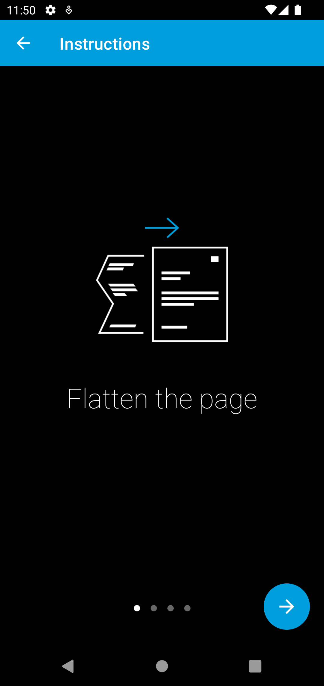
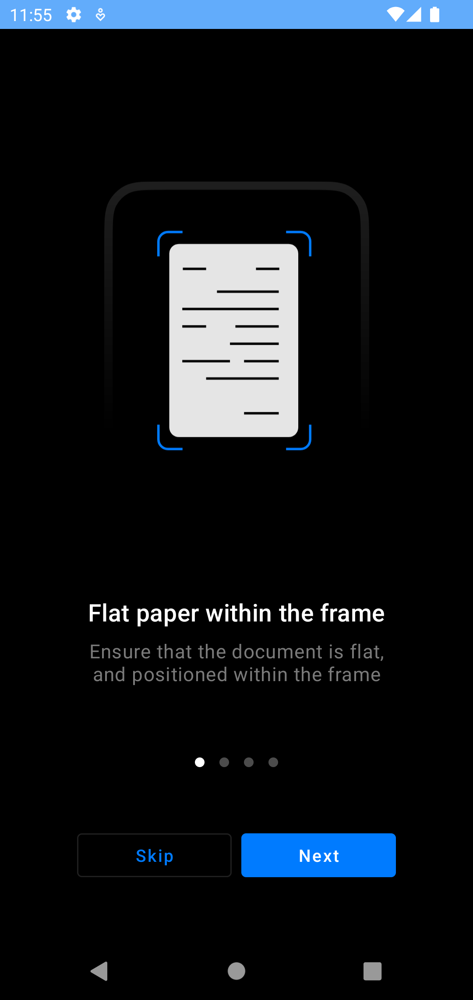

Migrate to 3.0.0
================

..
  Audience: Android dev who has integrated 1.0.0
  Purpose: Describe what is new in 3.0.0 and how to migrate from 2.0.0 to 3.0.0
  Content type: Procedural - How-To

  Headers:
  h1 =====
  h2 -----
  h3 ~~~~~
  h4 +++++
  h5 ^^^^^

In version 3.0.0 we modernized our UI and added support for light and dark modes. In addition, we simplified how the UI
is customized. We also unified the public API of the SDK and introduced an easier way to customize certain parts of the
UI.

Migrate from Component API
--------------------------

The Component API allowed more UI customization options at the cost of a more difficult integration and maintenance. It
was based on fragments, and you had to manage navigation between them and also update the navigation whenever we introduced
breaking changes.

Maintaining the Component API along with the simpler Screen API required an increasing amount of effort as we added new
features. We decided therefore to unify both APIs and introduce the ability to inject fully custom UI elements.

The major benefit of the Component API was the ability to use a custom navigation bar (toolbar or action bar). Via
UI injection that is still possible with the new public API.

The following steps will help you migrate to the new public API:

* Configure the SDK the same way as before by using ``GiniCapture``.
* If you used a custom navigation bar, then you can use the new ability to inject fully custom UI elements. For this you
  need to implement the ``NavigationBarTopAdapter`` interface and pass it to
  ``GiniCapture.newInstance().setNavigationBarTopAdapter()``. The ``NavigationBarTopAdapter`` interface declares the
  contract your view has to fulfill and allows the SDK to ask for your view instance when needed.
* Use the ``CameraActivity`` to launch the SDK instead of the ``CameraFragmentCompat``.
* Handle the result of the ``CameraActivity`` to receive the extracted information (error or cancellation).
* Remove all code related to interacting with the SDK's fragments. From now on the entry point is the ``CameraActivity``
  and customization happens through ``GiniCapture`` and via overriding of resources.
* Use the new UI customization options and follow the :ref:`screen-by-screen UI customization section<Migrate to the new
  UI>` to adapt the look of the new UI.

Migrate from Screen API
-----------------------

The new public API is based on the Screen API, so you only need to use the new UI customization options and follow the
:ref:`screen-by-screen UI customization section<Migrate to the new UI>` to adapt the look of the new UI.

Overview of New UI Customization Options
----------------------------------------

To simplify UI customization we introduced global customization options. There is no need to customize each screen
separately anymore.

Styles
~~~~~~

We leverage the power of Material Design to configure a theme for the SDK with a global color palette and typography
that is applied on all the screens. 

Using global styles for the various widgets, we enable you to customize them in a single place. They are then
consistently applied on all screens.

Theme
+++++

The theme style is based on Material Design v2 and is named ``GiniCaptureTheme``. To override the theme in your
application use ``Root.GiniCaptureTheme`` as the parent:

.. code-block:: xml

    

Widgets
+++++++

The style of buttons and other widgets is based on Material Design v3. To override them in your application use the
root style as the parent, for example:

.. code-block:: xml

    

Colors
~~~~~~

We introduced a global color palette which you are free to override. The custom colors will then be applied on all screens.

You can find the names of the colors `here <https://github.com/gini/gini-mobile-android/blob/main/capture-sdk/sdk/src/main/res/values/colors.xml>`_.

.. note::

    If you have overridden the ``GiniCaptureTheme`` then the theme colors you have set there will override the color
    palette customization.

Images
~~~~~~

Customizing images is done the same way as before via overriding of drawable resources. You can find the drawable
resource names in the :ref:`screen-by-screen UI customization section<Migrate to the new UI>`.

We replaced most drawables with vector drawables. Unfortunately due to the limitations of vector drawables some images
had to be added as PNGs.

If you use vector drawables please add them to the `drawable-anydpi` folder so that they also override any density specific PNGs.

Typography
~~~~~~~~~~

We introduced a global typography based on text appearance styles from Material Design v3. To override them in your application use the
root style as the parent, for example:

.. code-block:: xml

    

.. note::

  If you have overridden the ``GiniCaptureTheme`` then the text appearances you have set there will override the
  typography customization. The same applies to overridden widget styles where you have set a custom text appearance.

You can find all the typography styles `here <https://github.com/gini/gini-mobile-android/blob/main/capture-sdk/sdk/src/main/res/values/typography.xml>`_.

Text
~~~~

Text customization is done the same way as before via string resources.

You can find all the string resources `here <https://github.com/gini/gini-mobile-android/blob/main/capture-sdk/sdk/src/main/res/values/strings.xml>`_.

UI Elements
~~~~~~~~~~~

Certain elements of the UI can now be fully customized via UI injection. This allowed us to drop the Component API while
still allowing in-depth customization for certain parts of the UI.

UI injection utilizes view adapter interfaces which you can implement and pass to ``GiniCapture`` when configuring the
SDK. These interfaces declare the contract the injected view has to fulfill and allow the SDK to ask for your view
instance when needed.

The most important injectable UI element is the top navigation bar. You may also show the navigation bar on the bottom
using your own custom view. You can find more details `here <features.html#custom-ui-elements>`_.

Dark mode
~~~~~~~~~

To customize resource for dark mode add them to resource folders containing the ``-night`` resource qualifier.

Migrate to the new UI
---------------------

Onboarding
~~~~~~~~~~

Old and new UI:

|
The new onboarding screen uses the global UI customization options. You can discard the old screen specific
customizations.

Images and text are onboarding page specific and need to be customized for each page.

`Here <customization-guide.html#onboarding-screen>`_ you can find the detailed description on how to customize this screen.

Breaking Changes
++++++++++++++++

Setting Custom Onboarding Pages
^^^^^^^^^^^^^^^^^^^^^^^^^^^^^^^

The ``OnboardingPage`` class was changed to also allow setting a title for the page and inject a view for the
illustration.

You can use the ``ImageOnboardingIllustrationAdapter`` to display drawable resources.

If you are setting custom onboarding pages, then you have to create the ``OnboardingPage`` as shown in the example
below:

.. code-block:: java

    val page1 = OnboardingPage(
        R.string.your_title_page_1,
        R.string.your_message_page_1,
        ImageOnboardingIllustrationAdapter(R.drawable.your_illustration_page_1)
    )
    val page2 = OnboardingPage(
        R.string.your_title_page_2,
        R.string.your_message_page_2,
        ImageOnboardingIllustrationAdapter(R.drawable.your_illustration_page_2)
    )

    GiniCapture.newInstance()
        .setCustomOnboardingPages(arrayListOf(page1, page2))
        .build()

New Features
++++++++++++

Custom Illustration Views
^^^^^^^^^^^^^^^^^^^^^^^^^

By implementing the ``OnboardingIllustrationAdapter`` interface and passing it to either ``GiniCapture`` or the
``OnboardingPage`` constructor you can inject any custom view for the illustration.

For example if you need to show animated illustrations you can use a `Lottie
<https://github.com/airbnb/lottie-android>`_ view in your ``OnboardingIllustrationAdapter`` implementation.

You can find more details `here <customization-guide.html>`_.

QR code scanning
~~~~~

Breaking Changes
++++++++++++++++

QR code scanning UI and functionality are changed. Scanning and processing happens automatically. You can find more details `here <features.html#qr-code-scanning>`_.

Help
~~~~~

The new help screen uses the global UI customization options.

New Features
++++++++++++

Bottom navigation bar
^^^^^^^^^^^^^^^^^^^^^

You can show a bottom navigation bar by passing true to ``GiniCapture`` ``setBottomNavigationBarEnabled``. There is a default implementation, but you can also use
your own by implementing the ``HelpNavigationBarBottomAdapter`` interface and passing it to ``GiniCapture``.

You can find more details `here <features.html#help-screen-customization>`_ and `here <features.html#bottom-navigation-bar>`_.

Analysis
~~~~~~~~

The new analysis screen uses the global UI customization options.

Breaking Changes
++++++++++++++++

The new analysis screen does not show the page count of PDF files and preview image for photo documents.

New Features
++++++++++++

Custom activity indicator view
^^^^^^^^^^^^^^^^^^^^^^^^^^^^^^

There is a default implementation for indicating that document analysis is in progress, but you can show your own activity indicator
by implementing the ``CustomLoadingIndicatorAdapter`` interface and passing it to ``GiniCapture``.

You can find more details `here <features.html#analysis-screen-customization>`_.
