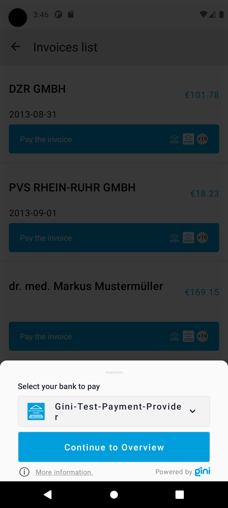
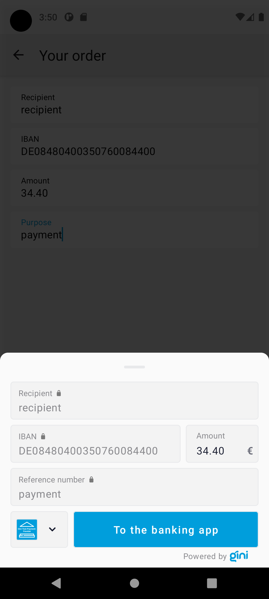

Testing
=======

Requirements
------------

Example banking app
~~~~~~~~~~~~~~~~~~~

An example banking app is available in the `Gini Bank SDK <https://github.com/gini/gini-mobile-android/tree/main/bank-sdk>`_
repository called ``example-app``.

You can use the same Gini Health API client credentials in the example banking app as in your app, if not otherwise
specified.

Development Gini Health API client credentials
~~~~~~~~~~~~~~~~~~~~~~~~~~~~~~~~~~~~~~~~~~~~~~

In order to test using the Gini Bank SDK's example banking app, you will need to use development client credentials in
your app for the Gini Health SDK. This will make sure the Gini Health SDK receives test payment providers that work
with the Gini Bank SDK's example banking app.

End to end testing
------------------

Example banking app
~~~~~~~~~~~~~~~~~~~

After you've set the client credentials in the Gini Bank SDK example app you can install it on your device by using the
``devPaymentProvider1Debug`` build flavor. This will allow the Gini Health SDK to detect it as the banking app for
the ``Gini-Test-Payment-Provider``.

.. note::
    You can also install the Gini Bank SDK example app's ``devPaymentProvider2Debug`` and ``devPaymentProvider3Debug`` build
    variants to test with two additional example banking apps named ``GiniBank`` and ``Bank``.

Payment Fragment
~~~~~~~~~~~~~~~~

By following the `flow guide <flow.html>`_ you should be showing the ``PaymentFragment`` in your hierarchy.

Depending on how the fragment is instantiated, with document id or with payment details, the first shown screen will differ.

If the user is a new user (has not finalised any payment flow within the app) the ``PaymentComponentBottomSheet`` will be displayed,
allowing the user to select a payment provider with which to continue.

If the user is a returning one and the ``PaymentFragment`` was instantiated with a document id, the ``ReviewFragment`` will be shown.
Otherwise, if payment details were used to start the flow, the ``ReviewBottomSheet`` will be displayed.

Payment component bottom sheet
~~~~~~~~~~~~~~~~~

The ``PaymentComponentBottomSheet`` allows the user to select a payment provider for the payment flow and also
provides an entry point to read more information about the payment feature and FAQs.

|

Bank picker
~~~~~~~~~~~

By clicking the picker in the ``PaymentComponentBottomSheet`` or the payment provider icon in the ``ReviewFragment`` or the ``ReviewBottomSheet``
you should see the ``BankSelectionBottomSheet`` with the list of available banking apps (including
``Gini-Test-Payment-Provider`` and other testing and production apps). If a bank picker was previously selected,
it should be highlighted in the list.

.. image:: images/testing/BankSelectionBottomSheet.png
    :alt: Screenshot of BankPickerBottomSheet where Gini-Test-Payment-Provider is selected.
    :width: 200px
    :align: center

|

More information and FAQ
~~~~~~~~~~~~~~~~~~~~~~~~

By clicking either the ``more information`` or the info icon on the ``PaymentComponentView`` you should see the
``MoreInformationFragment`` with information about the payment feature and an FAQ section.

.. image:: images/testing/MoreInformationScreen.png
    :alt: Screenshot of the More Information and FAQ screen.
    :width: 200px
    :align: center

|

Payment review
~~~~~~~~~~~~~~~

By clicking the "Pay the invoice" button on the ``PaymentComponentBottomSheet`` you should see either the ``ReviewFragment`` or the ``ReviewBottomSheet``, depending on
how the flow was started: if a document id was used, the ``ReviewFragment`` will be shown, otherwise the ``ReviewBottomSheet`` will be displayed.

The ``ReviewFragment`` shows the invoice's pages and the payment information. It also allows editing the payment information. The "To the
banking app" button should have the colors of the banking app, which was selected in the
``PaymentComponentBottomSheet``. There is also a picker with the icon of the banking app, which will display the ``BankSelectionBottomSheet`` when tapped.

.. image:: images/testing/PaymentReviewScreen.png
    :alt: Screenshot of the Payment Review screen showing the Gini-Test-Payment-Provider.
    :width: 200px
    :align: center

The ``ReviewBottomSheet`` is very similar to the ``ReviewFragment``, but there are two differences: there are no pages shown, and only the ``Amount`` field of
the payment details is editable.

|

Execute payment
~~~~~~~~~~~~~~~

When clicking the "To the banking app" button on the ``ReviewFragment`` or the ``ReviewBottomSheet`` you should be redirected to the example banking
app where the payment information will be fetched from Gini (including any changes you made on the
``ReviewFragment`` or the ``ReviewBottomSheet``). Press the "Pay" button to execute a test payment which will mark the payment as paid in the
Gini Health API.

.. image:: images/testing/BankSDKExampleAppPaymentDetails.png
    :alt: Screenshot of the example banking app showing the same payment information as the Payment Review screen previously.
    :width: 200px
    :align: center

|

Return to your app
~~~~~~~~~~~~~~~~~~~

After the test payment has been executed, the example banking app should show a "Return to Business" button which should
take you back to your app.

With these steps completed you have verified that your app, the Gini Health API, the Gini Health SDK and the Gini Bank
SDK work together correctly.

.. image:: images/testing/BankSDKExampleAppReturnToBusinessApp.png
    :alt: Screenshot of the example banking app showing the "Return to Business" button with the same extractions as previously.
    :width: 200px
    :align: center

|

Testing in production
---------------------

The steps are almost the same with the only difference, that instead of the development client credentials you will need
to use production credentials in your app. This will make sure the Gini Health SDK receives only real payment providers
which open real banking apps.

You will also need to install a banking app which uses the Gini Bank SDK. You should be able to install these from the
list shown by clicking the bank picker button in a ``PaymentComponentBottomSheet``.
