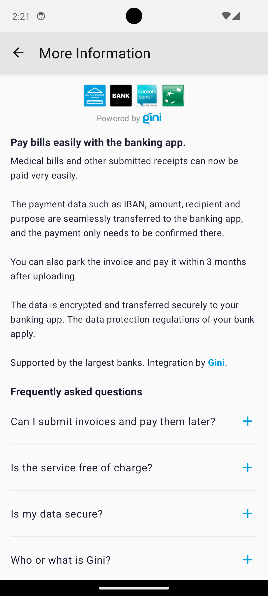
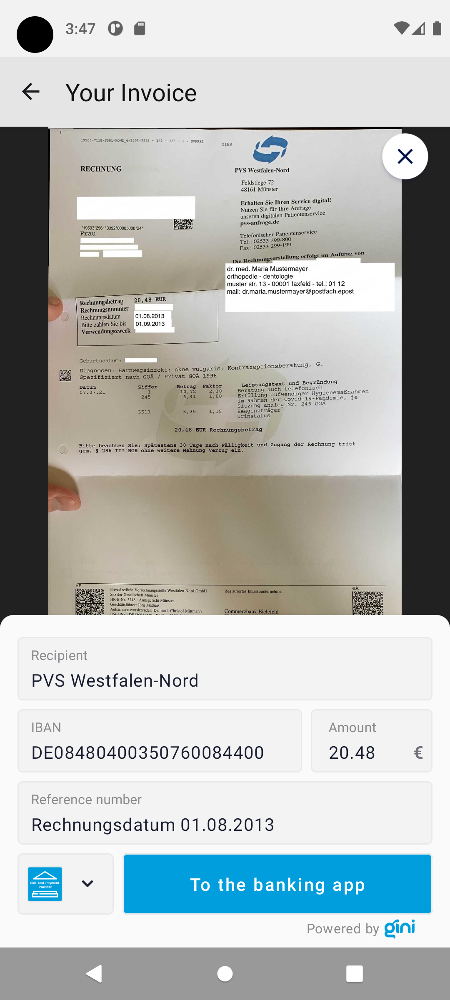

Testing
=======

Requirements
------------

Example banking app
~~~~~~~~~~~~~~~~~~~

An example banking app is available in the `Gini Bank SDK <https://github.com/gini/gini-mobile-android/tree/main/bank-sdk>`_
repository called ``example-app``.

You can use the same Gini Health API client credentials in the example banking app as in your app, if not otherwise
specified.

Development Gini Health API client credentials
~~~~~~~~~~~~~~~~~~~~~~~~~~~~~~~~~~~~~~~~~~~~~~

In order to test using the Gini Bank SDK's example banking app, you will need to use development client credentials in
your app for the Gini Health SDK. This will make sure the Gini Health SDK receives test payment providers that work
with the Gini Bank SDK's example banking app.

End to end testing
------------------

Example banking app
~~~~~~~~~~~~~~~~~~~

After you've set the client credentials in the Gini Bank SDK example app you can install it on your device by using the
``devPaymentProvider1Debug`` build flavor. This will allow the Gini Health SDK to detect it as the banking app for
the ``Gini-Test-Payment-Provider``.

.. note::
    You can also install the Gini Bank SDK example app's ``devPaymentProvider2Debug`` and ``devPaymentProvider3Debug`` build
    variants to test with two additional example banking apps named ``GiniBank`` and ``Bank``.

Payment component
~~~~~~~~~~~~~~~~~

By following the `flow guide <flow.html>`_ you should be showing the ``PaymentComponentView`` for each invoice in your
app's list of invoices. The following screenshot shows a sample list of invoices where the ``PaymentComponentView`` is
shown for each invoice.

.. image:: images/testing/PaymentComponentViews.png
    :alt: Screenshot of invoices list with PaymentComponentViews showing the Gini-Test-Payment-Provider.
    :width: 200px
    :align: center

|

Bank picker
~~~~~~~~~~~

You should see the ``Gini-Test-Payment-Provider`` preselected in every ``PaymentComponentView``.  By clicking the picker
you should see the ``BankSelectionBottomSheet`` with the list of available banking apps (including
``Gini-Test-Payment-Provider`` and other testing and production apps).

|

More information and FAQ
~~~~~~~~~~~~~~~~~~~~~~~~

By clicking either the ``more information`` or the info icon on the ``PaymentComponentView`` you should see the
``MoreInformationFragment`` with information about the payment feature and an FAQ.

|

Payment review
~~~~~~~~~~~~~~~

By clicking the "Pay the invoice" button on a ``PaymentComponentView`` you should see the ``ReviewFragment``, which
shows the invoice's pages and the payment information. It also allows editing the payment information. The "To the
banking app" button should have the icon and colors of the banking app, which was selected in the
``PaymentComponentView``.

|

Execute payment
~~~~~~~~~~~~~~~

When clicking the "To the banking app" button on the ``ReviewFragment`` you should be redirected to the example banking
app where the payment information will be fetched from Gini (including any changes you made on the
``ReviewFragment``). Press the "Pay" button to execute a test payment which will mark the payment as paid in the
Gini Health API.

.. image:: images/testing/BankSDKExampleAppPaymentDetails.png
    :alt: Screenshot of the example banking app showing the same payment information as the Payment Review screen previously.
    :width: 200px
    :align: center

|

Return to your app
~~~~~~~~~~~~~~~~~~~

After the test payment has been executed, the example banking app should show a "Return to Business" button which should
take you back to your app.

With these steps completed you have verified that your app, the Gini Health API, the Gini Health SDK and the Gini Bank
SDK work together correctly.

|

Testing in production
---------------------

The steps are almost the same with the only difference, that instead of the development client credentials you will need
to use production credentials in your app. This will make sure the Gini Health SDK receives only real payment providers
which open real banking apps.

You will also need to install a banking app which uses the Gini Bank SDK. You should be able to install these from the
list shown by clicking the bank picker button in a ``PaymentComponentView``.
